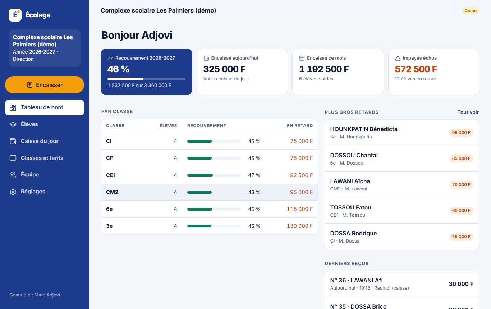
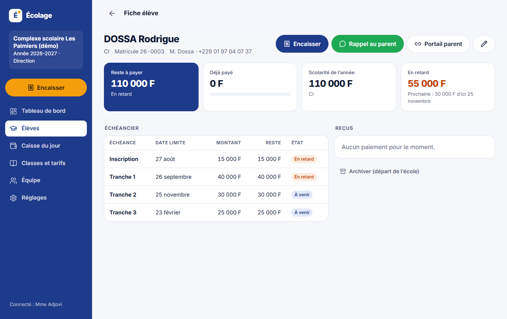
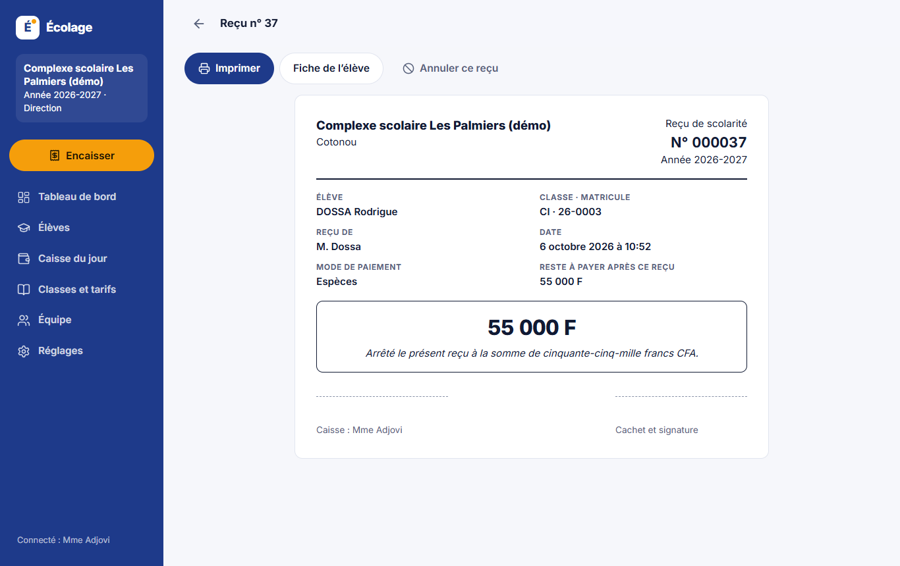
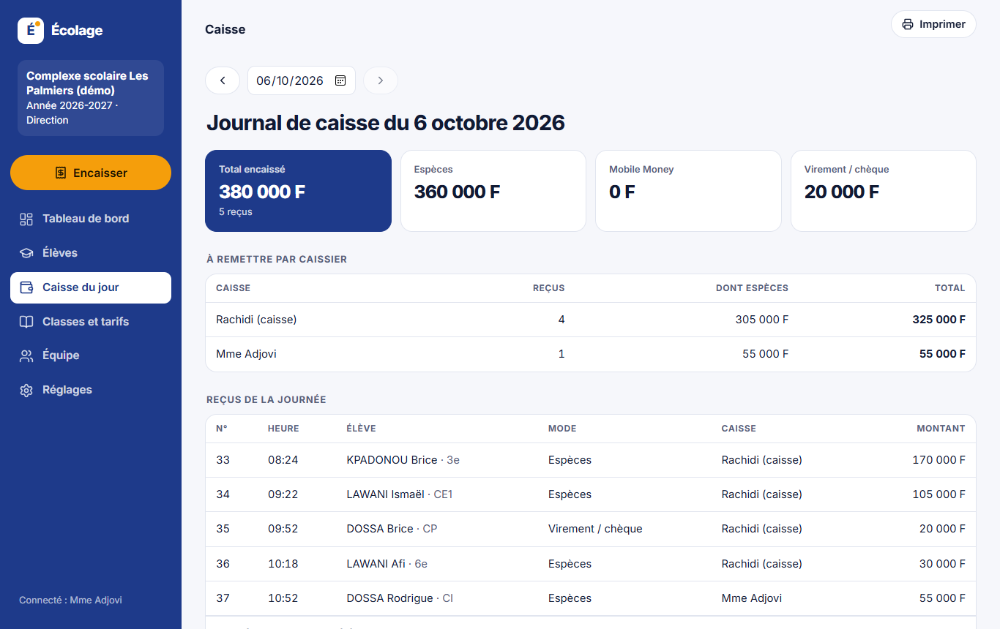
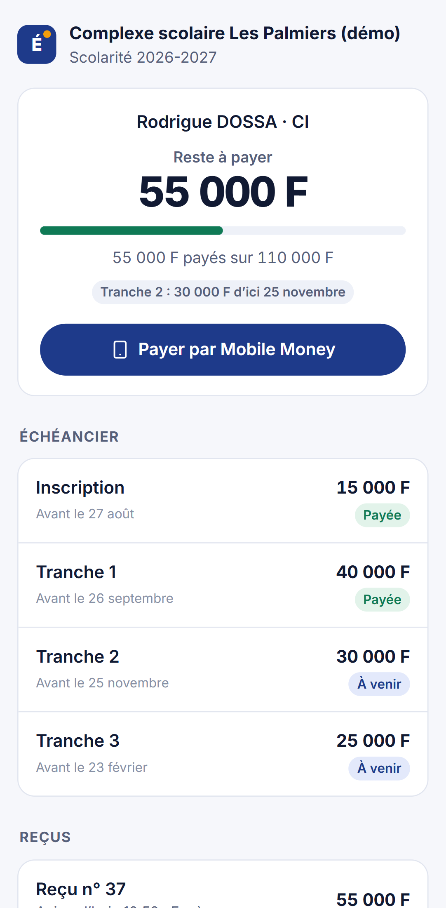

# Écolage · la scolarité de votre école, sans cahier

[](https://github.com/kabirADEMON/ecolage/actions/workflows/ci.yml)


Dans beaucoup d'écoles privées au Bénin, les frais de scolarité (« l'écolage ») se suivent encore dans un registre. Les reçus sont écrits à la main, se perdent, et rien n'empêche d'en faire disparaître un. Les parents ne savent pas exactement ce qu'il leur reste à payer. En fin de trimestre, la direction passe des jours à recouper le registre avec la caisse pour savoir qui est en retard.

**Écolage est l'outil de la caisse et de la direction** : un échéancier par classe, des reçus numérotés imprimés au guichet, un journal de caisse chaque soir, et un portail où chaque parent voit la situation de son enfant et paie en **Mobile Money**.

<p align="center">
  
</p>
<p align="center">
  
  
</p>
<p align="center">
  
  
</p>

## Ce que fait l'application

**Direction**

- Classes et **échéanciers** (inscription, tranches et dates limites). Modifier un échéancier recalcule tous les élèves de la classe, sans toucher aux paiements déjà reçus.
- **Réductions** (fratrie, bourse), retirées des dernières tranches.
- **Import** de la liste d'élèves collée depuis Excel. L'import est « tout ou rien » et signale chaque ligne à corriger. Les matricules sont attribués automatiquement.
- **Tableau de bord** : taux de recouvrement, encaissé du jour et du mois, retards par classe, plus gros impayés, export CSV des impayés.
- **Annulation d'un reçu** avec un motif obligatoire. Le reçu reste dans la caisse, barré, avec le nom de la personne qui l'a annulé.
- **Équipe** : comptes caissiers avec mot de passe provisoire, désactivation immédiate, réinitialisation.

**Caisse**

- Retrouver un élève par nom ou matricule, encaisser en espèces, en Mobile Money ou par virement, avec des montants proposés (le retard, la prochaine tranche, toute l'année).
- **Reçu A5 imprimable** : numéro unique, montant en chiffres et **en lettres** (« Arrêté le présent reçu à la somme de… »), reste à payer, cachet. Envoi au parent sur WhatsApp en un clic.
- **Journal de caisse** du jour : total par mode de paiement et **ce que chaque caissier doit remettre**.

**Parents (sans compte)**

- Un lien personnel, révocable : échéancier, reçus téléchargeables, paiement **MTN MoMo ou Moov Money** via FedaPay. Le reçu est émis automatiquement.

**Démo** : « Essayer avec une école d'exemple » crée une école complète (6 classes, 24 élèves, paiements et retards réalistes) propre à chaque visiteur, effacée après 24 h.

## Les choix techniques

| Sujet                | Choix                                                                                                                                                                                                                                                            | Pourquoi                                                                                                                                                 |
| -------------------- | ---------------------------------------------------------------------------------------------------------------------------------------------------------------------------------------------------------------------------------------------------------------- | -------------------------------------------------------------------------------------------------------------------------------------------------------- |
| Numéros de reçu      | Compteur par école, incrémenté par un `UPDATE … RETURNING` **dans la transaction de l'encaissement**, plus une contrainte `UNIQUE (école, numéro)`.                                                                                                              | Deux caisses qui encaissent au même instant obtiennent deux numéros consécutifs, jamais le même ni un trou. C'est testé avec 8 encaissements simultanés. |
| Reçus                | Un reçu ne se supprime pas. L'annulation exige un motif et un auteur, et une contrainte `CHECK` garantit que ces trois champs sont remplis ensemble. Un numéro annulé n'est jamais réattribué.                                                                   | Tout reçu remis à un parent reste traçable : c'est la base de la confiance.                                                                              |
| Trop-perçu           | L'encaissement verrouille la ligne de l'élève (`SELECT … FOR UPDATE`) avant de vérifier le reste à payer.                                                                                                                                                        | Deux caissiers ne peuvent pas encaisser deux fois la même tranche.                                                                                       |
| Situation de l'élève | **Jamais stockée** : recalculée à partir de l'échéancier, de la réduction et des reçus valides, par des fonctions pures testées (`src/domain/fees.ts`). Les paiements soldent les tranches dans l'ordre.                                                         | Changer un tarif ou annuler un reçu met tout à jour sans migration de données.                                                                           |
| Rôles                | Direction et caisse. Les routes sensibles passent par un middleware `requireDirector`, et le caissier peut corriger une fiche mais pas la classe ni la réduction.                                                                                                | Les décisions qui engagent de l'argent restent à la direction.                                                                                           |
| Sessions             | JWT dans un cookie `HttpOnly` `SameSite=Lax`, avec une version de session. Changer de mot de passe ou désactiver un caissier **coupe ses sessions immédiatement**. Le compte est verrouillé 15 min après 5 échecs, et les mots de passe sont hachés avec scrypt. |                                                                                                                                                          |
| Paiement en ligne    | Webhook FedaPay signé (HMAC-SHA256, horodatage limité contre le rejeu) et idempotent, plus une vérification auprès de FedaPay au retour du parent.                                                                                                               | Un paiement donne un reçu, un seul, même si le webhook est rejoué ou en retard.                                                                          |
| Montant en lettres   | Conversion maison en orthographe rectifiée (« quatre-vingts », « deux-cents », « mille » invariable), testée sur les cas difficiles.                                                                                                                             | C'est ce que les parents attendent d'un reçu.                                                                                                            |
| Base de données      | PostgreSQL avec Drizzle ORM et migrations SQL. Sans `DATABASE_URL`, l'API utilise **PGlite** (Postgres en WebAssembly).                                                                                                                                          | Le projet se lance sans rien installer, et les tests tournent sur le vrai moteur Postgres.                                                               |
| Interface            | React 19, TanStack Query, PWA. Barre latérale sur l'ordinateur de la caisse, barre en bas sur téléphone, feuille de style d'impression A5.                                                                                                                       |                                                                                                                                                          |

## Architecture

```
apps/
  api/                Express 5 · TypeScript · Drizzle · Zod
    src/domain/       échéancier, réductions, montant en lettres (fonctions pures)
    src/services/     situation des élèves, encaissement et reçus, tableau de bord, école d'exemple
    src/routes/       auth, école et équipe, classes, élèves, paiements, portail parent, webhook
    drizzle/          migrations SQL
    test/             56 tests (Vitest + Supertest sur PGlite)
  web/                React 19 · TypeScript · React Router · TanStack Query · PWA
    e2e/              9 parcours Playwright (direction, caisse, parent)
```

## Lancer le projet

```bash
npm install
npm run dev        # API sur :3000, interface sur http://localhost:5173
npm run seed       # école d'exemple : direction 01 00 00 00 10 / ecole2026, caisse 01 00 00 00 11 / caisse2026
```

## Tests

```bash
npm test           # 56 tests : règles métier, rôles, reçus concurrents, annulation, caisse, import, portail, FedaPay
npm run build && npm run test:e2e   # 9 parcours dans un vrai navigateur
```

Les parcours de bout en bout jouent une rentrée complète. La directrice crée l'école, une classe et son échéancier, inscrit un élève avec une réduction, encaisse et imprime le reçu, puis ajoute un caissier. Le caissier se connecte avec son mot de passe provisoire, n'a pas accès à l'équipe, se voit refuser un trop-perçu et encaisse en Mobile Money. Le parent paie depuis son téléphone et télécharge son reçu. Enfin, la directrice annule un reçu en double, vérifie la caisse du jour et importe une liste d'élèves.

La CI GitHub Actions lance le formatage, les types, les tests de l'API, la compilation et les tests de bout en bout à chaque push.

## Déploiement

`render.yaml` (Render : service Docker et PostgreSQL) et `Dockerfile` sont fournis. Variables : `DATABASE_URL`, `JWT_SECRET` (obligatoire en production), `APP_URL`, `FEDAPAY_SECRET_KEY`, `FEDAPAY_WEBHOOK_SECRET`, `FEDAPAY_ENV`, `DEMO_MODE`, `TRUST_PROXY`. Le webhook FedaPay se déclare sur `https://<domaine>/api/webhooks/fedapay`.

## Et ensuite

- Rappels automatiques par SMS la veille des échéances.
- Plusieurs années scolaires et passage en classe supérieure.
- Bulletins de paiement trimestriels en PDF pour les parents.

## Licence

MIT, © 2026 Kabir ADEMON.
